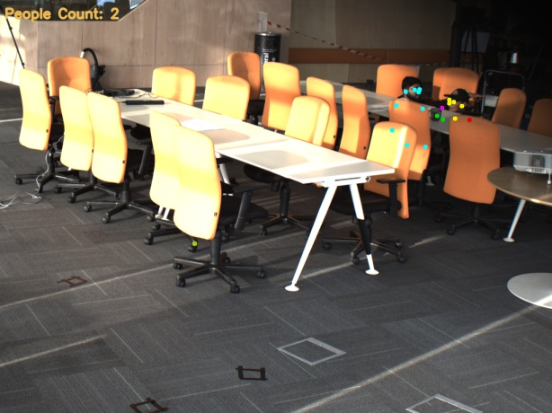
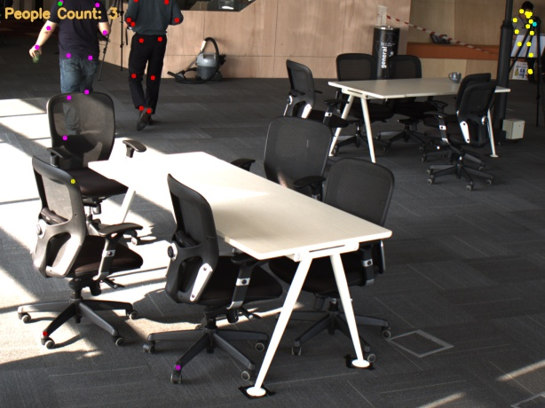
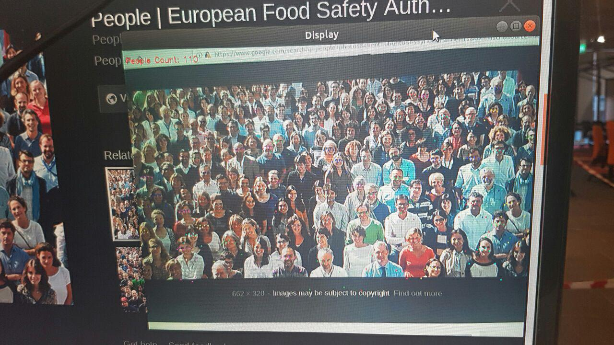

# pose-people-counter

Quantifies the number of people detected in a camera video stream, pushes the data to Firebase

Uses OpenCV to capture a video stream, sends the stream to a Tensorflow session loaded with a modified ResNet-101 model that outputs data that can be used by the algorithm implemented by [Eldar](https://github.com/eldar/pose-tensorflow) for associating detected body parts to poses, and hence, countable people.

The number of people is then pushed to Firebase for real-time logging with a partner script. You can also choose to record the annotated video and/or images!

This script uses threading! The video won't lag when inferences are happening!

Threads:    
1 - Inference    
2 - Video stream input    
3 - Video display    

------

Leverages this Human Pose estimation framework entirely: https://github.com/eldar/pose-tensorflow

Additional non-ML related code, some convenience updates, lots of tunable parameters, and a custom OpenCV video capture class was added.

## People Counting in Action

Haha, 110 counted! Pretty close!

------

 [.png)](https://www.buymeacoffee.com/methylDragon)